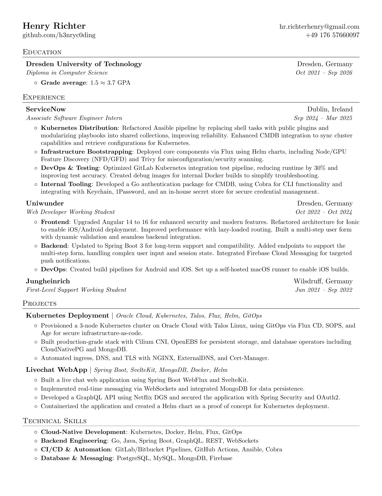

# Resume

This repository contains my resume, which is generated using LaTeX. 

The resume is designed to be clean, professional, and easy to read. It includes sections for education, experience, projects, and technical skills.


## [View Resume](generated/resume.pdf)




## Getting Started

To compile the LaTeX code and generate the PDF resume, you need to have `docker` installed. Simply run the following command in the root directory of the repository:

```bash
make build
```
